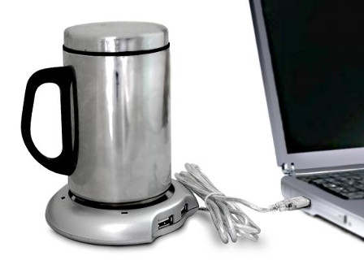

name: title
class: center

# IRC-Driven Development with Phergie
.byline[Matthew Turland]


---

name: before-we-start
class: center

# Before We Start

* This slide deck will be available at [http://matthewturland.com/publications](http://matthewturland.com/publications)
* Don't worry too much about taking notes &mdash; the [documentation](https://github.com/phergie/phergie-irc-bot-react/wiki) is decent
* If you have questions or feedback, ping me at [me@matthewturland.com](me@matthewturland.com) or in #phergie on [Freenode](http://freenode.net)

---

name: what-is-irc
class: center

# What is IRC?

* **I**nternet **R**elay **C**hat
* Client-server chat protocol built on [TCP](http://en.wikipedia.org/wiki/Internet_Relay_Chat)/[TLS](http://en.wikipedia.org/wiki/Transport_Layer_Security)
* Created in 1988, still used today
* [More about it](http://en.wikipedia.org/wiki/Internet_Relay_Chat)


---

name: what-is-phergie
class: center

# What is Phergie?

* An IRC bot
* Written in PHP
* Yes, really
* Stop laughing


---

name: why
class: center

# Why?!

* \#phpc on Freenode had a bot, Ai
* Source was never released
* Only one developer with little time


---

name: goals
class: center

# Goals

* A new bot written in modern PHP
* Open source
* Well-documented
* Easy to use
* [Easy to contribute to](http://www.brandonsavage.net/encouraging-open-source-contribution/)


---

name: irc-driven-development
class: center

# Why Do I Care?

* IRC-driven development ([one](http://tech.3scale.net/2012/06/06/irc-driven-developement/), [two](http://tech.3scale.net/2012/06/29/irc-driven-development-part-2/))
* tl;dr: IRC can be a communal REPL/shell
  * Access commonly needed data
  * Broadcast events in real time
  * Execute and manage deployments


---

name: react
class: center

# React

* No, not the [Facebook JS library](http://facebook.github.io/react/)
* Event-driven, non-blocking I/O in PHP
* Multiple components
  * [event-loop](https://github.com/reactphp/event-loop)
  * [promise](https://github.com/reactphp/promise)
  * [stream](https://github.com/reactphp/stream)
  * [dns](https://github.com/reactphp/dns)
  * [http-client](https://github.com/reactphp/http-client)
  * [more!](https://github.com/reactphp)

[http://reactphp.org](http://reactphp.org)

---

name: components
class: center

# Phergie Components

* Lower-level string handlers
  * [parser](https://github.com/phergie/phergie-irc-parser)
  * [generator](https://github.com/phergie/phergie-irc-generator)
* Data structures
  * [connections](https://github.com/phergie/phergie-irc-connection)
  * [events](https://github.com/phergie/phergie-irc-event)
* Add React and we have soup! 
  * [client](https://github.com/phergie/phergie-irc-client-react)
  * [bot](https://github.com/phergie/phergie-irc-bot-react)

---

name: bot
class: center

# Bot

.left[
Supplements [client](https://github.com/phergie/phergie-irc-client-react) with:
]
* [a configuration system](https://github.com/phergie/phergie-irc-bot-react/wiki/Usage#configuration)
* [more specialized events](https://github.com/phergie/phergie-irc-bot-react/wiki/Development#supported-events)
* [a plugin architecture](https://github.com/phergie/phergie-irc-bot-react/wiki/Development#plugins-defined)


---

name: plugins-and-events
class: center

# Plugins and Events

* [Plugins](https://github.com/phergie/phergie-irc-bot-react/wiki/Development) are a collection of event and callback specifications
* They implement [`PluginInterface`](https://github.com/phergie/phergie-irc-bot-react/blob/master/src/PluginInterface.php), which is modeled after [event subscribers](http://symfony.com/doc/current/components/event_dispatcher/introduction.html#using-event-subscribers) from the [Symfony](http://symfony.com) framework

```php
interface PluginInterface
{
    /**
     * Returns a mapping of events to applicable callbacks.
     *
     * @return array Associative array keyed by event name referencing
     * strings containing names of instance methods in the class
     * implementing this interface or valid callables
     */
    public function getSubscribedEvents();
}
```

---

name: event-subscriptions
class: center

# Event Subscriptions

```php
use Phergie\Irc\Bot\React\PluginInterface;
use Phergie\Irc\Event\EventInterface as Event;
use Phergie\Irc\Bot\React\EventQueueInterface as Queue;

class ExamplePlugin implements PluginInterface {
    public function getSubscribedEvents() {
        return [
            // this...
            'event_name' => 'methodInThisClass',

            // ... is the same as this
            'event_name' => [$this, 'methodInThisClass'],

            // this works too
            'event_name' => ['OtherClass', 'otherMethod'],

            // so does this
            'event_name' => function(Event $event, Queue $queue) {
                // ...
            },
        ];
    }
}
```

---

name: greeter-example
class: center

# Greeter Example

```php
use Phergie\Irc\Bot\React\PluginInterface;
use Phergie\Irc\Event\UserEventInterface as Event;
use Phergie\Irc\Bot\React\EventQueueInterface as Queue;

// Don't ever actually do this, unless you want to annoy your patrons.

class GreeterPlugin implements PluginInterface {
    public function getSubscribedEvents() {
        return [
            'irc.received.join' => 'greetUser',
        ];
    }

    public function greetUser(Event $event, Queue $queue) {
        $channel = $event->getSource();
        $nick = $event->getNick();
        $message = 'Hi ' . $nick . '! Welcome to ' . $channel . '!';
        $queue->ircPrivmsg($channel, $message);
    }
}
```

---

name: commands
class: center

# Commands

* [Command](https://github.com/phergie/phergie-irc-plugin-react-command): parses commands and parameters from messages
* [CommandHelp](https://github.com/phergie/phergie-irc-plugin-react-commandhelp): provides interactive help for registered commands
* [CommandAlias](https://github.com/phergie/phergie-irc-plugin-react-commandalias): implements command aliasing via configuration


---

name: command-example
class: center

# Command Example

```php
use Phergie\Irc\Bot\React\EventQueueInterface as Queue;
use Phergie\Irc\Bot\React\PluginInterface;
use Phergie\Irc\Plugin\React\Command\CommandEvent as Event;

class SayPlugin implements PluginInterface {
    public function getSubscribedEvents() {
        return [
            'command.say' => 'handleSay',
        ];
    }

    public function handleSay(Event $event, Queue $queue) {
        $source = $event->getSource();
        $message = implode(' ', $event->getCustomParams();
        $queue->ircPrivmsg($source, $message);
    }
}
```

```
In channel:

Me: say Hello world!
Bot: Hello world!
```

---

name: command-plugins
class: center

# Command Plugins

* [Dns](https://github.com/WyriHaximus/PhergieDns): performs DNS lookups
* [JoinPart](https://github.com/phergie/phergie-irc-plugin-react-joinpart): joining and parting channels
* [Quit](https://github.com/phergie/phergie-irc-plugin-react-quit): disconnecting from servers
* [OpsWorksDeployment](https://github.com/blopboard/phergie-irc-plugin-opsworksdeployment): managing Amazon OpsWorks deployments

---

name: avoid-blocking
class: center

# Avoid Blocking

* React and Phergie core don't block
* [OpsWorksDeployment](https://github.com/blopboard/phergie-irc-plugin-opsworksdeployment) blocks because it uses the [AWS SDK](http://aws.amazon.com/sdk-for-php/), which uses [Guzzle](http://guzzle.readthedocs.org/en/latest/), which uses blocking adapters
* [wyrihaximus/react-guzzle](https://github.com/WyriHaximus/ReactGuzzle) is a WIP non-blocking Guzzle adapter based on [react/http-client](https://github.com/reactphp/http-client) that I hope to use
* For simple non-blocking HTTP requests, use the [Http](https://github.com/WyriHaximus/PhergieHttp) plugin
* For non-blocking DNS lookups, use the [Dns](https://github.com/WyriHaximus/PhergieDns) plugin

---

name: url-plugins
class: center

# Handling URLs

* [Url](https://github.com/WyriHaximus/PhergieUrl): parses URLs from messages and emits them as events
* [Twitter](https://github.com/phergie/phergie-irc-plugin-react-twitter): responds to Twitter URLs with tweet information
* [YouTube](https://github.com/phergie/phergie-irc-plugin-react-youtube): responds to YouTube URLs with video information

---

name: url-example
class: center

# URL Example

```php
use Phergie\Irc\Bot\React\EventQueueInterface as Queue;
use Phergie\Irc\Bot\React\PluginInterface;
use Phergie\Irc\Event\UserEventInterface as Event;

class ExampleUrlPlugin implements PluginInterface {
    public function getSubscribedEvents() {
        return [
            'url.host.vimeo.com' => 'handleVimeoUrl',
            'url.host.all' => 'handleOtherUrl',
        ];
    }

    public function handleVimeoUrl($url, Event $event, Queue $queue) {
        // ...
    }

    public function handleOtherUrl($url, Event $event, Queue $queue) {
        // ...
    }
}
```

---

name: custom-event-emitter
class: center

# Custom Event Emitter

```php
use Evenement\EventEmitterInterface as Emitter;
use Phergie\Irc\Bot\React\EventEmitterAwareInterface;
use Phergie\Irc\Bot\React\EventQueueInterface as Queue;
use Phergie\Irc\Bot\React\PluginInterface;
use Phergie\Irc\Event\UserEventInterface as Event;

class NewUserPlugin implements PluginInterface,
    EventEmitterAwareInterface
    // or extends Phergie\Irc\Bot\React\AbstractPlugin {
    protecter $emitter;

    public function setEventEmitter(Emitter $emitter) {
        $this->emitter = $emitter;
    }

    public function getSubscribedEvents() {
        return ['irc.received.join' => 'newUser'];
    }

    public function newUser(Event $event, Queue $queue) {
        $nick = $event->getNick();
        $channel = $event->getSource();
        $this->emitter->emit('newuser.join',
            [$nick, $channel, $event, $queue]);
    }
}
```

---

name: custom-event-recipient
class: center

# Custom Event Recipient

```php
use Phergie\Irc\Bot\React\EventQueueInterface as Queue;
use Phergie\Irc\Bot\React\PluginInterface;
use Phergie\Irc\Event\UserEventInterface as Event;

class OtherPlugin implements PluginInterface {
    public function getSubscribedEvents() {
        return ['newuser.join' => 'handleJoin'];
    }

    public function handleJoin($nick, $channel, Event $event,
        Queue $queue) {
        // ...
    }
}
```

---

name: event-loop
class: center

# Event Loop

* Plugins are generally reactive
* Tasks repeated on an interval (e.g. polling) require accessing the underlying event loop
* Example: [FeedTicker](https://github.com/phergie/phergie-irc-plugin-react-feedticker)


---

name: event-loop-example
class: center

# Event Loop Example

```php
use Phergie\Irc\Bot\React\EventQueueInterface as Queue;
use Phergie\Irc\Bot\React\PluginInterface;
use Phergie\Irc\Client\React\LoopAwareInterface;
use Phergie\Irc\Event\UserEventInterface as Event;
use React\EventLoop\LoopInterface;

class OtherPlugin implements PluginInterface, LoopAwareInterface {
// or extends Phergie\Irc\Bot\React\AbstractPlugin
    public function setLoop(LoopInterface $loop) {
        // addTimer() for one-time callback
        // addPeriodicTimer() for repeated callback
        $this->loop->addPeriodicTimer(
            5,                       // Every 5 seconds...
            [$this, 'timedCallback'] // ... execute this callback
        );
    }

    public function timedCallback() {
        // ...
    }
}
```

---

name: bridge
class: center

# Bridge

* Allows external processes to send and receive IRC messages via middleware
* Integrates with middleware through adapters (e.g. HTTP, Redis)
* Adapters can pull messages or receive them via a socket
* Work in progress
* [Github repo](https://github.com/phergie/phergie-irc-plugin-react-bridge)

---

name: using-plugins
class: center

# Using Plugins

* Publish on [Packagist](http://packagist.org)
* Install using [Composer](https://getcomposer.org)
* Enable via a [PHP configuration file](https://github.com/phergie/phergie-irc-bot-react/wiki/Usage#configuration)



---

name: example-configuration
class: center

# Example Configuration

```
composer.json
```

```json
{
    "minimum-stability": "dev",
    "require": {
        "phergie/phergie-irc-bot-react": "dev-master",
        "phergie/phergie-irc-plugin-react-pong": "dev-master"
    }
}
```

```
config.php
```

```php
return [
    'connections' => [
        new \Phergie\Irc\Connection([
            'serverHostname' => 'irc.freenode.net',
            // ...
        ]),
    ],
    'plugins' => [
        new \Phergie\Irc\Plugin\React\Pong,
    ],
];
```

---

name: filtering-events
class: center

# Filtering Events

[EventFilter plugin](https://github.com/phergie/phergie-irc-plugin-react-eventfilter)

```php
use Phergie\Irc\Plugin\React\EventFilter as Filters;

$connection = new \Phergie\Irc\Connection([
    // ...
]);

return [
    'plugins' => [

        // Join #channel1 only on $connection
        new Filters\Plugin(array(
            'filter' => new Filters\ConnectionFilter([$connection]),
            'plugins' => array(
                new \Phergie\Irc\Plugin\React\AutoJoin\Plugin(
                    ['channels' => '#channel1']
                ),
            ),
        )),

    ]
];
```

---

name: thats-all-folks
class: center

# That's All Folks

* Questions? Comments? Discussion?
* [blopboard.com](http://www.blopboard.com)
* [matthewturland.com](http://matthewturland.com) for slides
* E-mail: [me@matthewturland.com](mailto:me@matthewturland.com)
* Twitter: [@elazar](http://twitter.com/elazar)
* Github: [elazar](http://github.com/elazar)
* Freenode: Elazar
